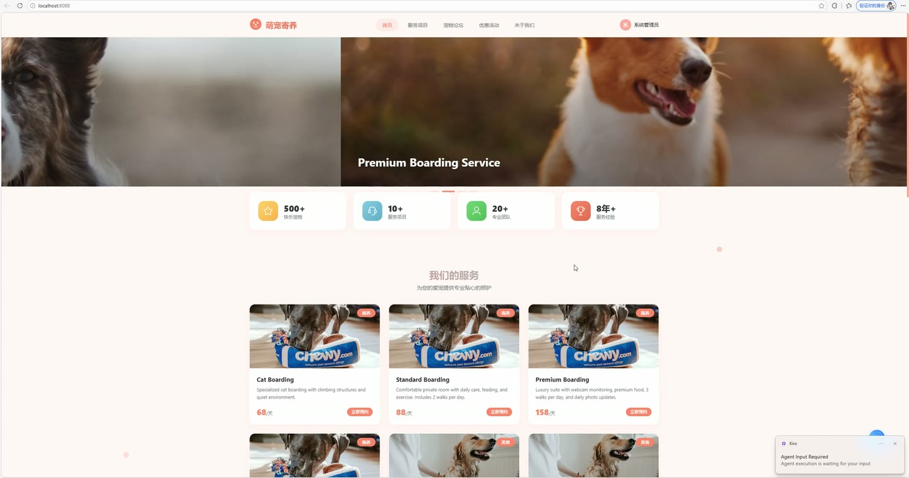
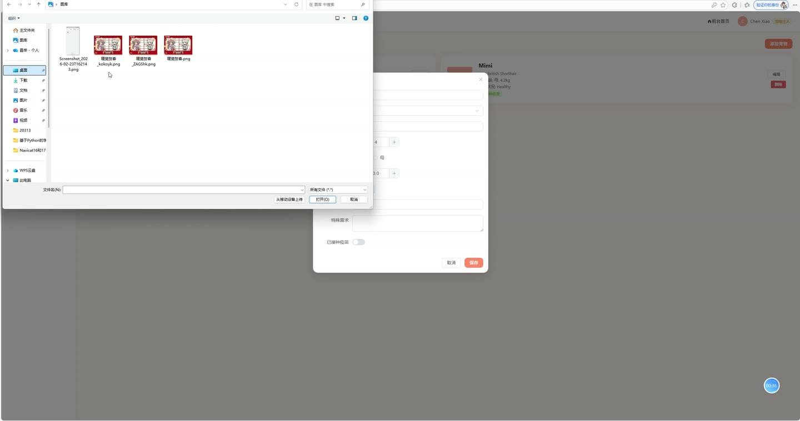

# (附文档)Springboot3+Vue3+MySQL 宠物寄养管理系统

**技术栈**：Springboot3、Vue3、MySQL

### 系统简介

本系统为宠物寄养管理平台，采用 SpringBoot3 + Vue3 前后端分离架构，包含前台展示门户与后台管理端。系统涵盖宠物主人、服务人员、管理员三种角色，实现宠物档案管理、寄养预约下单、订单全流程跟踪、健康记录登记、社区论坛互动、优惠活动发布等完整业务闭环。前台提供首页轮播、服务展示、论坛浏览等公开内容，后台按角色权限展示对应管理功能。
 
### 核心功能
 
### 普通用户端

 
- 注册账号：填写用户名、密码、昵称、手机号、邮箱提交注册，注册后账号状态为待审核，需管理员审核通过后方可登录 
- 登录认证：输入用户名和密码登录，支持演示账号快速填充，登录成功后返回 JWT Token 并存储用户信息 
- 个人资料管理：查看和编辑个人昵称、头像、手机号、邮箱等资料，保存后自动更新用户信息 
- 修改密码：输入原密码和新密码进行密码修改，原密码验证通过后更新为新密码 
- 宠物档案管理：添加宠物信息（名称、物种、品种、年龄、性别、体重、照片、健康状态、特殊需求、是否接种疫苗），可查看、编辑、删除自己的宠物档案 
- 预约寄养服务：选择宠物、服务项目、开始日期、结束日期，填写备注提交预约订单，系统自动生成订单号并计算总金额 
- 我的订单列表：分页查看个人订单列表，显示订单号、宠物名、服务名称、寄养日期、总金额、订单状态、支付状态 
- 订单支付：对未支付订单执行支付操作，将支付状态更新为已支付 
- 查看健康记录：查看订单关联的宠物健康记录，包括饮食、排泄、活动、心情、体温、异常情况、照片等 
- 论坛发帖：发布宠物相关帖子，填写标题、内容和图片，发布后自动统计浏览量和点赞数 
- 论坛评论：对帖子发表评论，评论内容在帖子详情页按时间顺序展示 
- 帖子点赞：对感兴趣的帖子进行点赞操作，点赞数实时累加 
- 浏览前台内容：查看首页轮播图、服务项目列表（按分类和价格排序）、优惠活动、论坛帖子列表及详情
 
### 管理员端

 
- 数据概览：查看平台核心统计数据，包括总用户数、总宠物数、总订单数、总收入、待处理订单数、进行中订单数、待审核用户数 
- 订单状态分布：查看各状态（待接单、已接单、进行中、已完成、已取消）订单数量统计 
- 宠物物种分布：统计狗、猫、鸟、兔及其他物种的宠物数量占比 
- 用户管理：分页查询用户列表，支持按角色（管理员/服务人员/宠物主人）和关键词（用户名/昵称/手机号）筛选，可查看用户详情 
- 用户状态审核：对注册用户进行状态审核（启用/禁用/待审核），控制用户登录权限 
- 用户角色分配：修改用户的角色权限，支持在管理员、服务人员、宠物主人之间切换 
- 新增用户：手动添加用户，设置用户名、密码、角色、状态，密码自动加密存储 
- 重置密码：将指定用户密码重置为默认密码 123456 
- 宠物管理：分页查看所有宠物档案，支持按关键词和物种筛选，可编辑、删除宠物信息 
- 服务项目管理：维护寄养服务项目（名称、描述、价格、计价单位、分类、图片、状态），支持按分类筛选 
- 订单管理：分页查看全部订单列表，展示订单完整信息（宠物名、主人名、服务人员名、服务名称），可修改订单状态、分配服务人员、删除订单 
- 轮播图管理：维护首页轮播图（标题、图片、链接、排序、状态），支持上传本地图片 
- 优惠活动管理：创建、编辑、删除优惠活动，设置活动标题、描述、图片、折扣、起止日期、状态 
- 论坛管理：查看全部帖子列表（含未审核帖子），可修改帖子状态（审核/下架）、编辑帖子内容、删除帖子 
- 评论管理：删除违规评论内容 
- 系统配置管理：维护系统配置项（配置键、配置值、描述），支持新增、编辑、删除配置
 
### 服务人员端

 
- 数据概览：查看平台整体运营数据统计，包括用户数、宠物数、订单数、收入等 
- 我的任务：查看分配给本人的寄养订单列表，显示宠物名、主人名、服务名称、寄养日期、订单状态 
- 宠物信息查看：查看平台所有宠物档案，了解宠物品种、健康状态、特殊需求等信息 
- 健康记录登记：为指定订单添加宠物健康记录，填写记录日期、饮食、排泄、活动、心情、体温、异常情况、照片 
- 健康记录维护：编辑、删除已登记的健康记录 
- 订单状态更新：将订单状态从待接单更新为已接单、进行中、已完成等状态
 
### 技术栈

 后端框架Spring Boot 3 ORM 框架MyBatis-Plus（含分页插件、逻辑删除、自动填充） 权限认证JWT（拦截器校验 Token）、AES 密码加密 前端框架Vue 3（Composition API） 状态管理Pinia（用户状态存储） 构建工具Vite UI 组件库Element Plus 数据库MySQL（支持逻辑删除、自动时间填充） 路由管理Vue Router（支持路由守卫） HTTP 通信Axios
 
### 交付内容

 
- 后端完整源码 
- 前端完整源码 
- 数据库初始化脚本 
- 万字文档

## 界面展示

---

## 获取完整源码 + 万字文档

本仓库为项目介绍页。**完整前后端源码、数据库初始化脚本、万字项目文档**，请加微信 `kangkangcode`，或访问 [codekk.top](http://codekk.top) 获取。

可作课程设计 / 毕业设计参考，支持远程部署调试。